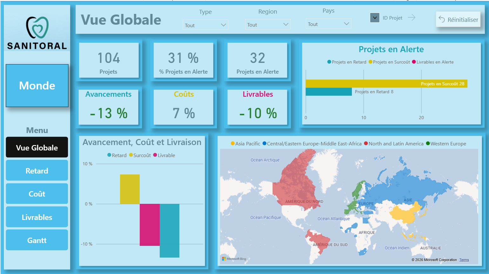
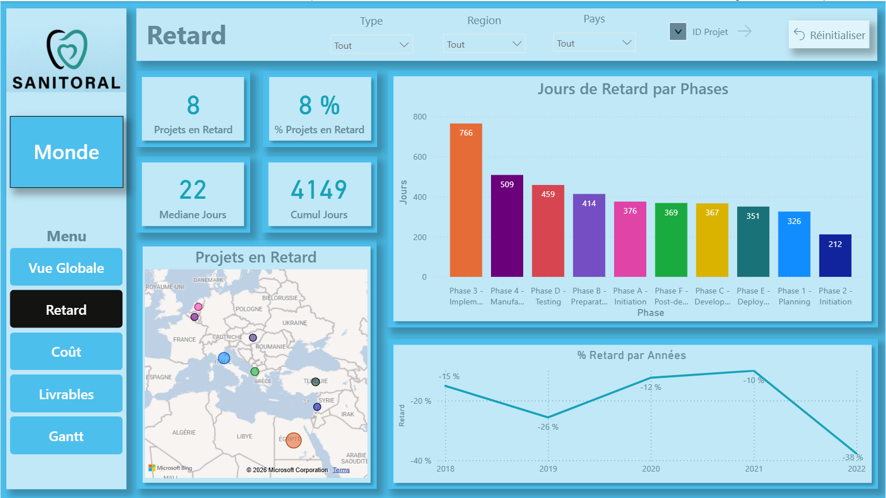
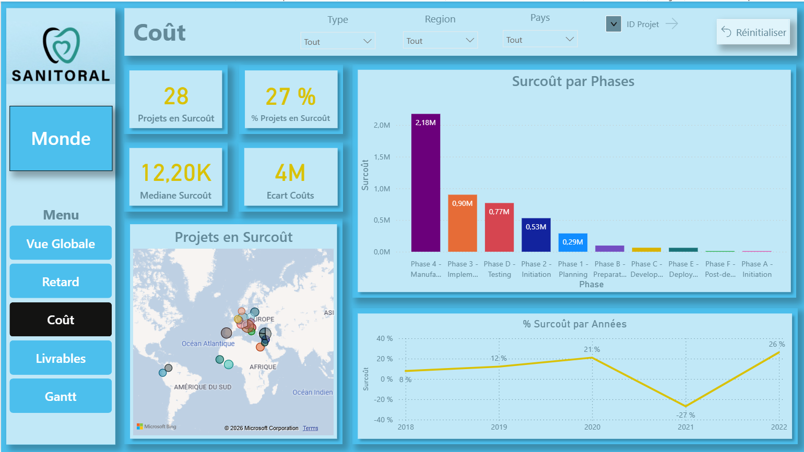
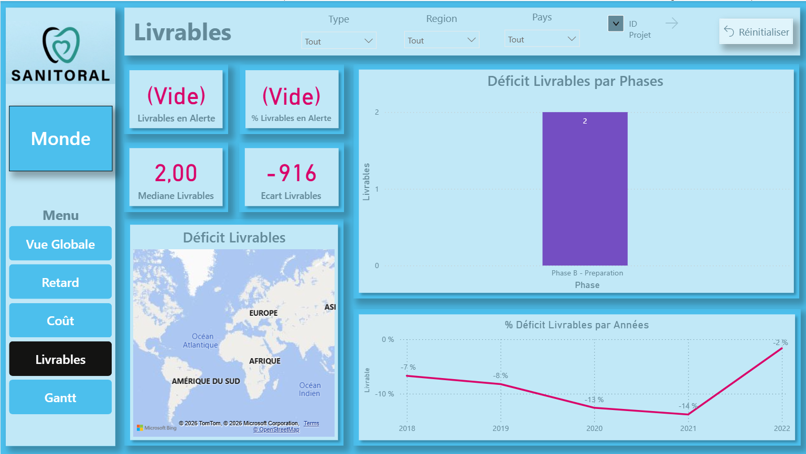
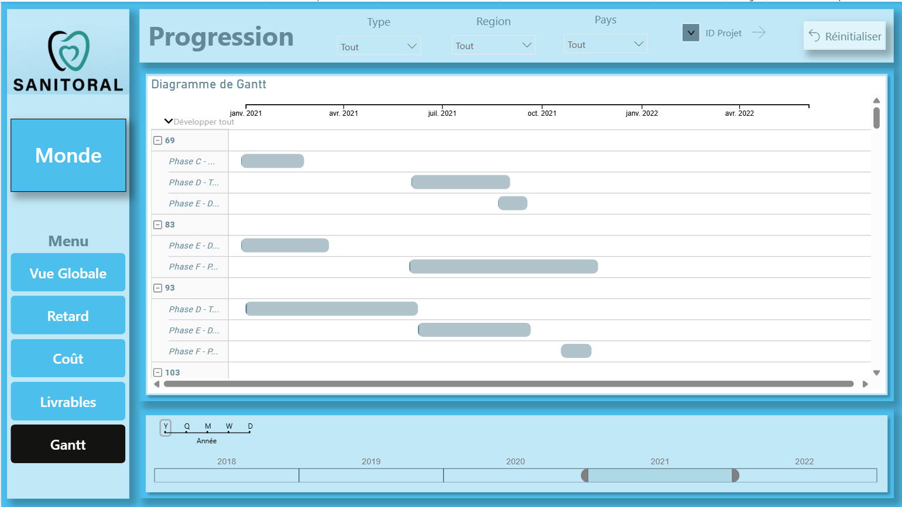
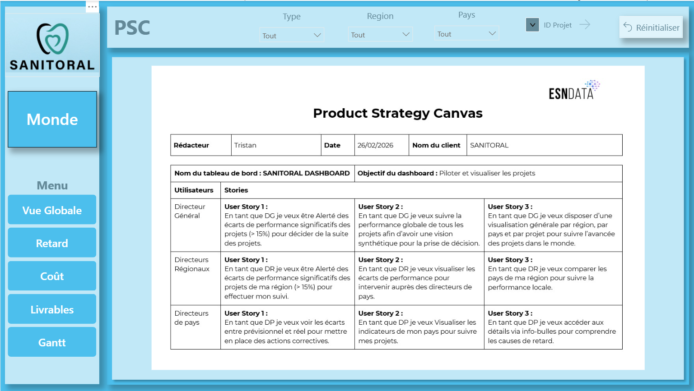

# P7 — Tableau de bord dynamique Power BI — Sanitoral Dashboard

> Projet de formation | Février 2026

## Contexte

Mission de consultant Data Analyst pour **Sanitoral**, entreprise internationale pilotant **104 projets** à l'échelle mondiale.  
Objectif : concevoir un dashboard Power BI permettant aux décideurs (DG, Directeurs Régionaux, Directeurs de Pays) de piloter la performance du portefeuille projets en temps réel.

## Stack technique

## Démarche

### 1. Cadrage — Product Strategy Canvas
Définition des user stories par profil utilisateur avant toute implémentation :

| Utilisateur | Besoin principal |
|-------------|-----------------|
| Directeur Général | Alertes sur écarts > 15%, vision synthétique mondiale |
| Directeurs Régionaux | Suivi régional, alertes projets, comparaison pays |
| Directeurs de Pays | Écarts prévisionnel/réel, détails via info-bulles |

### 2. Préparation des données (Power Query)
- Import et nettoyage des tables Excel (suppression lignes inutiles, transposition en-têtes)
- Construction d'un **modèle en étoile** (table de faits + tables de dimensions)
- Uniformisation des clés de jointure et vérification des cardinalités
- Modification du typage pour permettre le filtrage croisé

### 3. Dashboard — 8 vues interactives

| Vue | Contenu |
|-----|---------|
| **Vue Globale** | KPIs synthétiques, carte mondiale par région, graphique alertes |
| **Retard** | 8 projets en retard (8%), médiane 22j, jours perdus par phase, évolution annuelle |
| **Coût** | 28 projets en surcoût (27%), écart +4M€, surcoût par phase, évolution annuelle |
| **Livrables** | 0 livrable en alerte, déficit par phase, tendance annuelle |
| **Gantt** | Diagramme de progression par projet et phase, slider temporel |
| **PSC** | Product Strategy Canvas intégré au dashboard |
| **Infos** | Documentation des étapes de préparation et chargement des données |
| **Aide** | Guide utilisateur annoté |

Filtres globaux persistants : Type de projet / Région / Pays / ID Projet

### 4. Storytelling — Ce que le dashboard révèle

> *31% des projets en alerte — mais en creusant : les retards s'améliorent (-40% en 2022), les livrables sont à zéro déficit. Le vrai problème est structurel et ciblé : la dérive budgétaire sur les phases Manufacturing et Implementation.*

## Captures d'écran

| | |
|---|---|
|  |  |
|  |  |
|  |  |

## Livrables

- `screens/` — Captures d'écran de toutes les vues du dashboard
- `Product_Strategy_Canvas.docx` — PSC de cadrage
- `storytelling.pdf` — Trame de présentation orale
- `Donnees_Sanitoral.xlsx` — Données source
