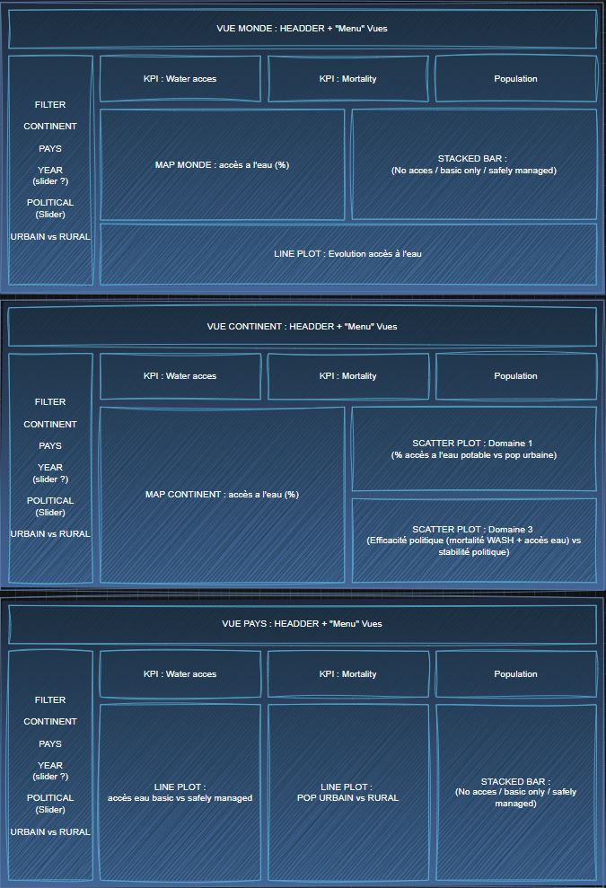
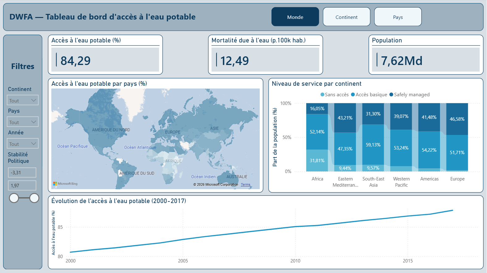
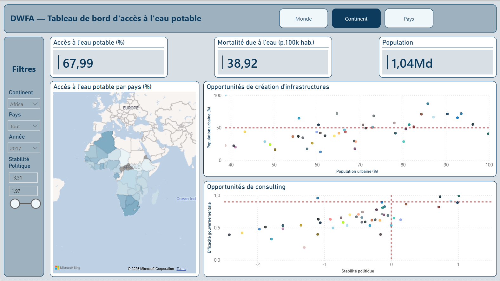
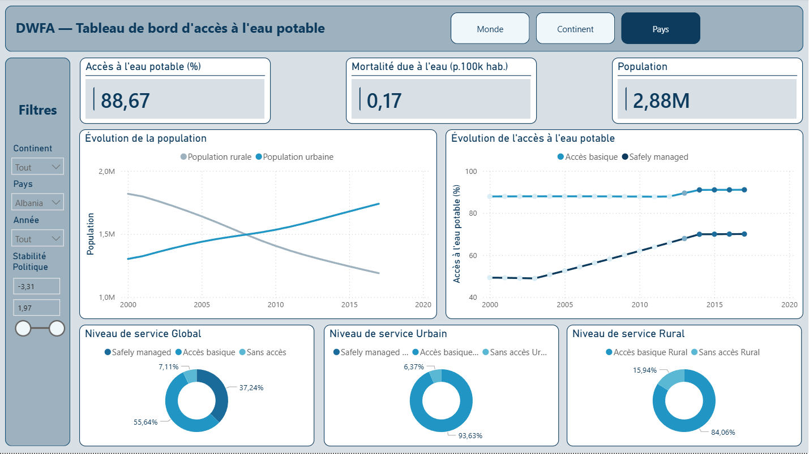

# P10 — Tableau de bord accès à l'eau potable — DWFA

> Projet de formation | Juin 2026

## Contexte

Mission pour **DWFA** (Drinking Water For All), ONG dont l'objectif est de donner accès à l'eau potable à tous. Le dashboard Power BI a pour but d'**identifier les pays prioritaires** pour orienter les futurs financements sur trois domaines d'intervention : création d'infrastructures, modernisation, et consulting gouvernemental.

Données OMS et Banque Mondiale — période **2000–2018**.

## Stack technique

## Démarche

### 1. Prétraitement Python
Avant tout import dans Power BI :
- Nettoyage des colonnes et pivot des tables pour aligner les granularités
- Filtrage des 45 territoires en doublon
- Calcul de 3 indicateurs dérivés dont un **score d'efficacité gouvernementale** (composite mortalité WASH + accès eau + stabilité politique)
- Export CSV formaté pour Power BI

### 2. Blueprint
Conception de la structure du dashboard avant implémentation — 3 vues définies en amont :

### 3. Dashboard — 3 vues interactives

| Vue | Contenu |
|-----|---------|
| **Monde** | Carte mondiale accès eau, stacked bar niveau de service par continent, évolution 2000–2018 |
| **Continent** | Carte continentale, scatter plot opportunités infrastructures (Domaine 1), scatter plot opportunités consulting (Domaine 3) |
| **Pays** | Diagnostic complet : évolution pop urbaine/rurale, accès basique vs safely managed, donuts niveau de service global/urbain/rural |

Filtres communs : Continent · Pays · Année · Stabilité Politique (slider)

## Captures d'écran

| Vue Monde | Vue Continent |
|-----------|---------------|
|  |  |

| Vue Pays |
|----------|
|  |

## Limites méthodologiques

- Mortalité WASH disponible uniquement pour 2016 — pas de suivi temporel possible
- "Safely managed" présente beaucoup de valeurs manquantes
- Score d'efficacité gouvernementale = indicateur construit pour ce projet, à interpréter avec précaution

## Storytelling

> *"84% d'accès à l'eau potable mondialement — mais derrière ce chiffre global, l'Afrique tourne à 32% de safely managed pendant que l'Europe est à 47%. Le dashboard permet d'identifier en un clic où investir selon le domaine : infrastructures pour les pays à forte urbanisation et faible accès, consulting pour ceux qui ont la capacité gouvernementale mais pas encore les résultats."*

## Livrables

- `screens/` — Captures d'écran des 3 vues + blueprint
- `despont_tristan_1_presentation` — Support de soutenance
- `blueprint.docx` — Maquette de conception
