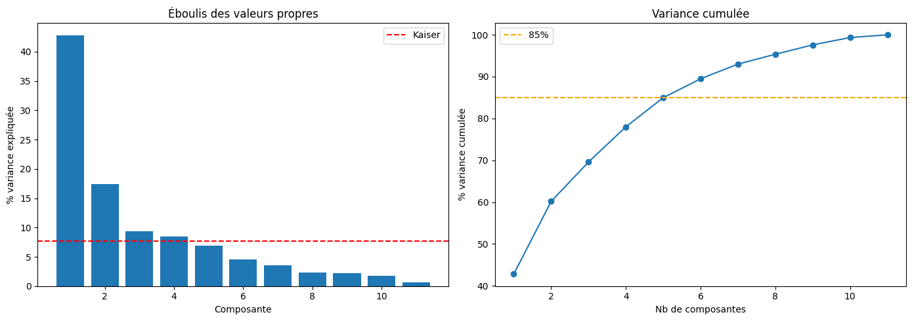
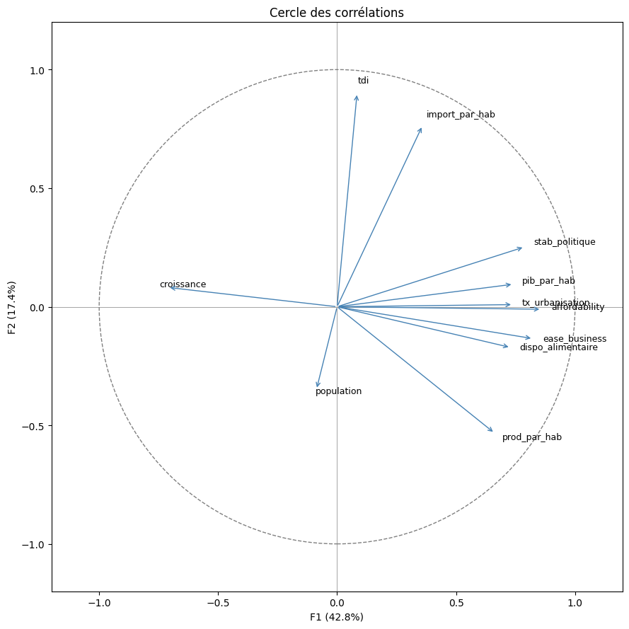
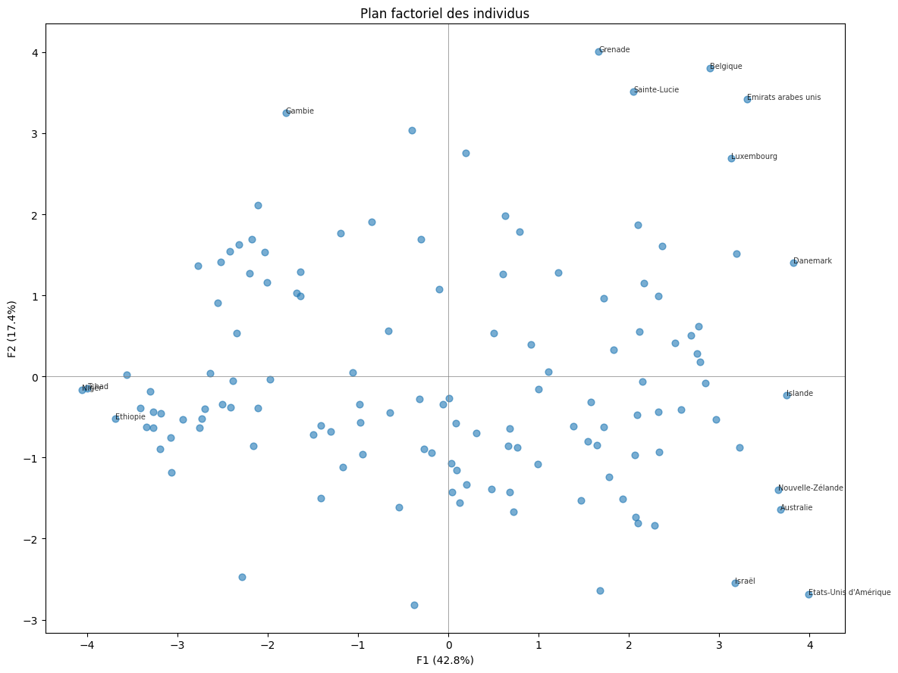
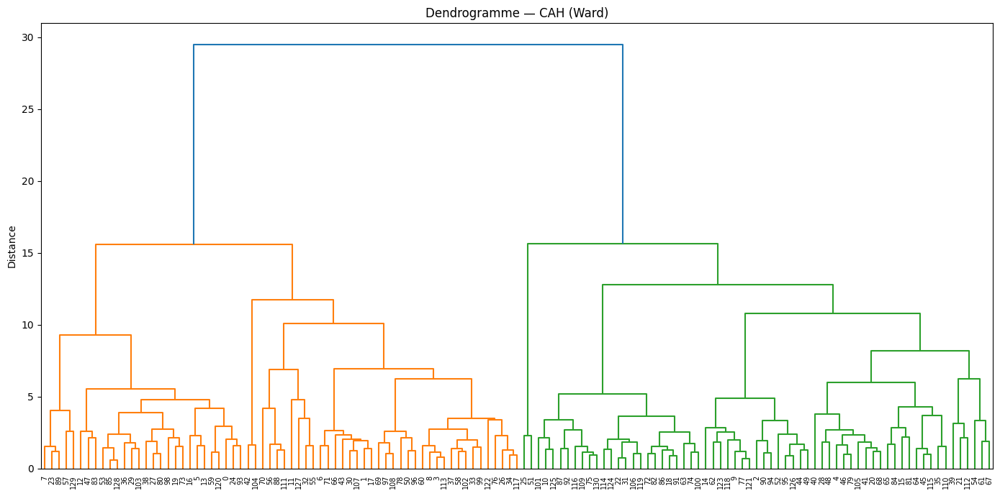
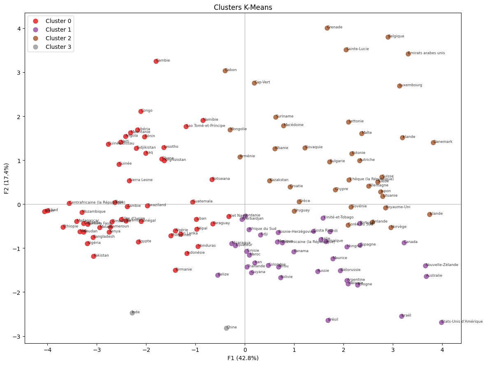
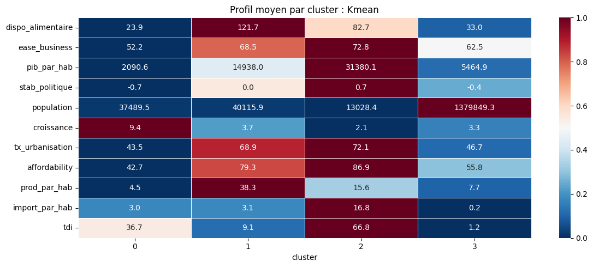
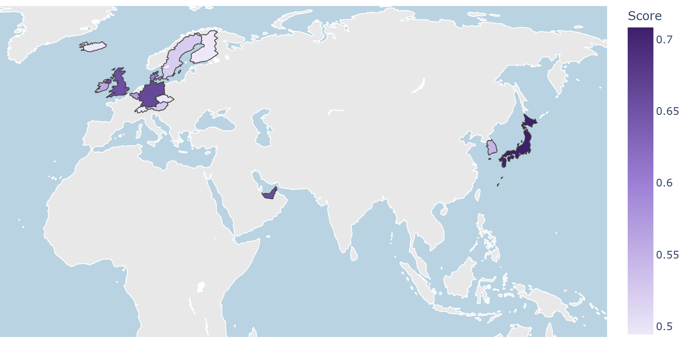
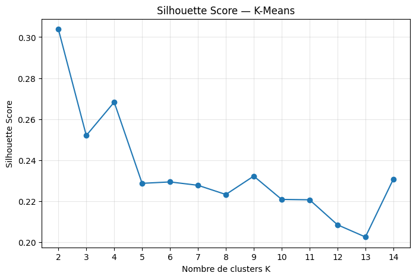

# P11 — Étude de marché export avec Python — La Poule qui Chante

> Projet de formation | Juin 2026

## Contexte

Mission de Data Analyst pour **La Poule qui Chante**, producteur de volailles bio, afin d'identifier les meilleurs marchés à l'international parmi 131 pays. Analyse complète depuis la collecte jusqu'au clustering et scoring stratégique, présentée au COMEX.

Sources : **FAO** (disponibilité alimentaire, production, imports volaille) + **Banque Mondiale** (PIB/hab, stabilité politique, urbanisation, ease of business) — données 2017, 90% de la population mondiale couverte.

> *Le poulet représente 90% du marché mondial de la volaille — les données FAO sont pleinement représentatives.*

## Stack technique

## Démarche

### 1. Variables — Cadre PESTEL
11 variables retenues dont 4 calculées :

| Variable | Source | Type |
|----------|--------|------|
| dispo_alimentaire | FAO | Brute |
| prod_par_hab | FAO | Calculée |
| import_par_hab | FAO | Calculée |
| tdi (Trade Dependency Index) | FAO | Calculée |
| pib_par_hab | Banque Mondiale | Brute |
| affordability | Banque Mondiale | Calculée |
| ease_business | Banque Mondiale | Brute |
| stab_politique | Banque Mondiale | Brute |
| population | Banque Mondiale | Brute |
| croissance | Banque Mondiale | Brute |
| tx_urbanisation | Banque Mondiale | Brute |

### 2. ACP — Réduction dimensionnelle
- 5 composantes retenues → **85% de la variance expliquée**
- F1 (42,8%) : axe de développement économique
- F2 (17,4%) : axe de dépendance commerciale aux imports
- La zone cible (riche + importateur) se situe en haut à droite du plan factoriel

### 3. Clustering — CAH + K-Means
- **CAH** (Ward) → dendrogramme → K=4 identifié
- **K-Means** → méthode du coude + silhouette score → K=4 confirmé
- K-Means retenu : clusters plus compacts et homogènes que la CAH

### 4. Profils des 4 clusters

| Cluster | Nb pays | Profil | Cible ? |
|---------|---------|--------|---------|
| 0 | 53 | Pays en développement — PIB 2 091€/hab, affordability 42, instables | ❌ |
| 1 | 39 | Pays développés autosuffisants — riches mais imports 3,1 kg/hab | ❌ |
| 2 | 37 | Pays développés importateurs — PIB 31 380€, affordability 86,9, imports 16,8 kg/hab | ✅ |
| 3 | 2 | Chine + Inde — outliers démographiques, hors périmètre | ❌ |

### 5. Scoring & Top 15
Score composite sur les 37 pays du Cluster 2 :

| Critère | Pondération |
|---------|-------------|
| Affordability | 30% |
| Imports par habitant | 25% |
| Population | 25% |
| Ease of business | 20% |

> TDI exclu : trop corrélé aux imports par habitant — redondant.

**Podium :** 🥇 Japon · 🥈 Allemagne · 🥉 Émirats arabes unis

Trois zones géographiques prioritaires : Europe occidentale (proximité), Asie-Pacifique (premium), Moyen-Orient (très forte dépendance aux imports).

## Captures d'écran

| | |
|---|---|
|  |  |
|  |  |
|  |  |
|  |  |

## Storytelling

> *"Sur 131 pays, un seul cluster réunit toutes les conditions : des pays riches, qui importent massivement, dans un environnement business favorable. 37 pays. Le Japon d'abord — dépendance structurelle aux imports, grand marché, affordability solide. L'Allemagne — leader européen, ease of business excellent. Les Émirats — petit pays mais imports par habitant exceptionnellement élevés. Les États-Unis et le Canada ? Riches, mais autosuffisants. La Chine ? Hors périmètre pour un premier export. Le clustering ne ment pas."*

## Livrables

- `screens/` — Visualisations (ACP, clustering, heatmap, carte)
- `Despont_Tristan_1_preparation_nettoyage_analyse_exploratoire` — Notebook EDA & preprocessing
- `Despont_Tristan_2_clusturing_visualisations` — Notebook ACP, clustering, scoring
- `Despont_Tristan_3_presentation` — Support de soutenance COMEX
