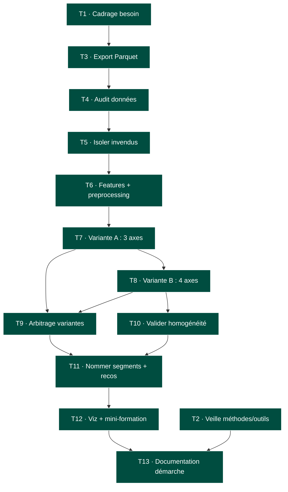
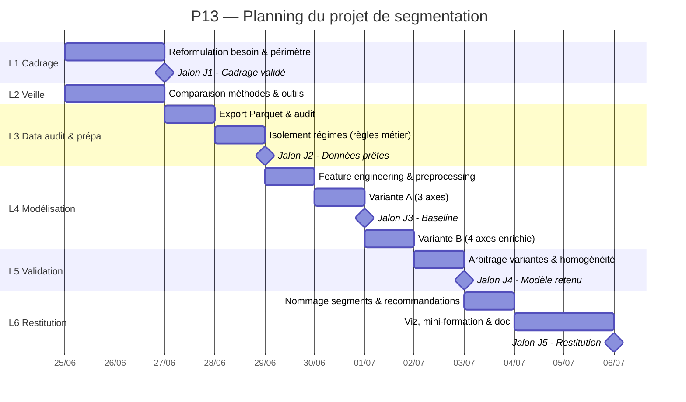

# P13 — Documentation de la démarche
### Amélioration du livrable P6 par une approche de Machine Learning non supervisé

> **Projet** : Segmentation automatisée du catalogue BottleNeck par clustering
> **Livrable d'origine** : Notebook P6 — Analyse du stock et des ventes

---

## 1. Cahier des charges fonctionnel

### 1.1 Contexte

Le projet P6 a produit une analyse exploratoire descriptive du catalogue de BottleNeck
(caviste en ligne) : nettoyage et fusion des sources ERP / web / liaison, puis analyse
univariée du prix, du chiffre d'affaires, des quantités vendues, du stock et de la marge.

Cette analyse, **variable par variable**, répond à un besoin de constat mais pas de décision :
elle ne dit pas *comment regrouper les produits* pour piloter l'assortiment.

### 1.2 Problématique métier reformulée

> *« Tous les produits du catalogue ne se valent pas. Peut-on les regrouper automatiquement
> en familles cohérentes — selon leur positionnement, leur volume de ventes, leur ancienneté
> et leur rotation de stock — afin d'orienter les décisions d'assortiment, de pricing et de
> gestion de stock ? »*

L'approche consiste à regrouper les produits en **familles de comportements**, chacune appelant
une stratégie différenciée (sécuriser, accélérer, déstocker…). La segmentation est
**multivariée et data-driven** : ce n'est pas l'analyste qui fixe les segments a priori, c'est
l'algorithme qui les révèle, l'analyste se chargeant de les interpréter et de les nommer.

### 1.3 Périmètre

| Traité | Non traité |
|---|---|
| Segmentation du **cœur de catalogue actif** (produits en vente, vendus au moins une fois) | Prévision de ventes dans le temps (pas d'historique daté exploitable dans les données) |
| Variables : prix, ventes cumulées, ancienneté de la fiche, rotation de stock | Données externes (météo, concurrence, saisonnalité) |
| Isolement des produits « hors régime » (invendus) par règle métier | Recommandation produit / personnalisation client |

### 1.4 Contraintes

- **Données** : snapshot (octobre), pas de série temporelle → **forecasting exclu d'emblée**.
- **Volumétrie** : 714 produits → faible volume, modèles à interpréter avec prudence (POC, non déployable en l'état).
- **Qualité** : présence d'anomalies de saisie identifiées en P6 (prix négatifs, marge < 0, stock incohérent).
- **Reproductibilité** : résultats stables d'une exécution à l'autre (graines fixées, pas de dépendance à la date courante).
- **Outillage** : Python / pandas / scikit-learn, notebook VS Code (env `data_env`).

### 1.5 Critères de réussite (critères d'acceptation)

| Niveau | Critère | Cible |
|---|---|---|
| **Data** | Aucune valeur manquante / infinie sur les variables de clustering | 0 NaN, 0 inf |
| **Data** | Anomalies métier isolées avant modélisation | Invendus + marges négatives + stock incohérent sortis du scope |
| **Modèle** | Nombre de segments justifié par une métrique objective | Silhouette |
| **Modèle** | Robustesse testée par comparaison | ≥ 2 algorithmes ET ≥ 2 jeux de variables comparés |
| **Opérationnel** | Résultat reproductible | `random_state` fixé, date d'ancrage figée, source en Parquet |
| **Métier** | Segments interprétables et actionnables | Chaque segment nommé + 1 recommandation |

---

## 2. Veille métier et technologique

### 2.1 Besoin de veille

Passer d'une **analyse univariée manuelle** (P6) à une **segmentation multivariée automatisée**
suppose de choisir : (a) une méthode de regroupement, (b) une méthode de choix du nombre de
groupes, et (c) d'envisager des outils de fiabilisation de la donnée en amont. La veille porte
donc sur ces trois axes.

### 2.2 Panel de solutions évaluées

| Axe | Solution | Cas d'usage | Avantages | Limites | Décision |
|---|---|---|---|---|---|
| **Méthode de clustering** | **KMeans** | Partitionnement de données numériques sur géométrie « plate » | Rapide, simple, bien documenté, centroïdes interprétables | Suppose des clusters sphériques de taille proche ; sensible à l'échelle et aux outliers | **Retenu** (meilleure silhouette sur nos données) |
| | Clustering hiérarchique (Agglomératif / Ward) | Données sans k connu a priori, lecture par dendrogramme | Pas besoin de fixer k au départ, structure hiérarchique lisible | Plus coûteux, moins stable ici | **Comparé** (témoin de robustesse) |
| | DBSCAN | Clusters de forme arbitraire, détection de bruit | Trouve k automatiquement, robuste au bruit | Paramétrage `eps` délicat, mauvais sur densités variables | Écarté (paramétrage non adapté au volume) |
| **Choix du nombre de clusters** | Score de silhouette + méthode du coude | Validation interne de la partition | Critères objectifs et chiffrés, croisables | Silhouettes modestes sur données en continuum | **Retenu** (les deux convergent) |
| **Qualité de données (amont)** | **Pandera** | Validation de DataFrame en notebook / pipeline ML | Léger (~12 dépendances), API proche de pandas, type-safe façon Pydantic, validation statistique intégrée | Centré pandas/Polars, pas de reporting « stakeholder » natif | Piste retenue pour industrialisation future |
| | Great Expectations | Qualité de données en pipeline de production | Multi-moteur (pandas/Spark/SQL), Data Docs lisibles par le métier, gouvernance | Lourd (100+ dépendances), surdimensionné pour un notebook | Écarté à ce stade (sur-ingénierie) |

### 2.3 Critères de comparaison

Qualité du résultat (séparation des groupes), robustesse/biais, coût en temps de calcul,
reproductibilité, interprétabilité, et maintenabilité/poids de l'outil.

### 2.4 Sources

- scikit-learn — *2.3. Clustering* (documentation officielle, comparatif des algorithmes) : https://scikit-learn.org/stable/modules/clustering.html
- scikit-learn — *Selecting the number of clusters with silhouette analysis* : https://scikit-learn.org/stable/modules/generated/sklearn.cluster.KMeans.html
- endjin — *Data validation in Python: a look into Pandera and Great Expectations* : https://endjin.com/blog/a-look-into-pandera-and-great-expectations-for-data-validation
- *The data validation landscape in 2025* (A. Turrell) : https://aeturrell.com/blog/posts/the-data-validation-landscape-in-2025/

---

## 3. Démarche : hypothèses, tests, résultats, décisions

> Cette section trace les choix de modélisation, leurs justifications, et les pistes écartées.
> C'est le cœur de la démarche critique : chaque décision est argumentée et, le cas échéant,
> documentée *même quand elle conduit à écarter une option*. La démarche repose sur la
> **comparaison de deux variantes de segmentation** (jeu de variables restreint vs enrichi),
> arbitrées sur des critères explicites.

### 3.1 Préparation : isoler les régimes particuliers avant le ML

**Hypothèse** : tous les produits ne relèvent pas du même *régime*. Un produit jamais vendu
ou vendu à perte n'est pas « un produit qui vend peu » : c'est un état qualitatif distinct.

**Décision** : isoler ces cas par **règle métier explicite** *avant* le clustering, plutôt que
de demander à l'algorithme de les deviner.

| Règle (par priorité) | Volume |
|---|---|
| Invendus : `total_sales == 0` | 25 produits |
| Vendus à perte : `tx_marge < 0` | 1 produit — **déjà capté par la règle invendus** |
| → Cœur de catalogue (clustering) | 689 produits |

**Décision documentée** : le segment « vendu à perte » a été **envisagé puis écarté** — un seul
produit concerné, déjà invendu. Créer un segment pour une ligne serait un artefact. Le produit
hybride est rattaché aux invendus (règle « invendu prioritaire »).

### 3.2 Choix des variables (features)

**Anti-fuite de données (data leakage)** — deux variables explicitement **exclues** des features
dans toutes les variantes :
- `ca` (= `total_sales × price`) : colinéaire aux entrées, simple changement d'échelle.
- `price_zscore` : transformation directe de `price`.

**Marge écartée des axes** : `tx_marge` est quasi-plate (75 % des produits entre 56,6 % et 66,3 %).
Une variable non discriminante n'aide pas à séparer des groupes et n'ajoute que du bruit. Elle est
**conservée en lecture seule** pour qualifier les segments a posteriori — pas pour les former.

### 3.3 Pré-traitement (justifié par la forme des distributions)

Deux opérations distinctes, à ne pas confondre :

| Opération | Appliquée à | Pourquoi |
|---|---|---|
| `log1p` (transformation log) | `price`, `total_sales`, `stock_mois` | Corriger l'**asymétrie à droite** (longue traîne de valeurs élevées qui écraserait les distances) |
| (pas de log) | `anciennete` | Asymétrie à **gauche** : le log la dégraderait |
| `StandardScaler` | tous les axes | KMeans raisonne en **distances** : sans mise à l'échelle commune, une variable aux grands nombres (ancienneté en jours) écraserait les autres |

### 3.4 Comparaison de deux variantes de segmentation

C'est le cœur de la démarche comparative : **deux jeux de variables** testés, mêmes algorithmes,
mêmes métriques, puis arbitrage.

| | **Variante A — 3 axes** | **Variante B — 4 axes (enrichie)** |
|---|---|---|
| Variables | prix, ventes, ancienneté | prix, ventes, ancienneté, **rotation de stock** |
| Périmètre | 689 produits | 688 (retrait d'une anomalie `stock_mois < 0`) |
| Meilleure silhouette KMeans | **0,400** (k=3) | 0,387 (k=3) |
| k=4 viable ? | Non (chute à 0,333) | Oui (0,375, proche du max) |

**Choix du nombre de clusters** : pour les deux variantes, silhouette et coude de l'inertie
convergent. KMeans domine le clustering hiérarchique sur la silhouette à toutes les valeurs de k
(ex. variante A, k=3 : 0,400 vs 0,367) → **KMeans retenu**, hiérarchique conservé comme témoin
de robustesse.

### 3.5 Arbitrage multi-critères

| Critère | Favorise | Commentaire |
|---|---|---|
| **Netteté statistique** (silhouette) | Variante A | 0,400 > 0,387 : la version simple sépare très légèrement mieux |
| **Parcimonie / reproductibilité** | Variante A | Moins d'axes = modèle plus simple, plus stable |
| **Valeur métier** | **Variante B** | Révèle un segment *invisible* dans A : 32 produits à stock dormant |

**Décision finale : variante B (4 axes, k=4).** On accepte une perte marginale de netteté
statistique (−0,013 de silhouette) contre un gain franc de valeur métier : un segment
décisionnel que la variante A masquait. *La netteté statistique n'est pas le seul critère de
décision — l'actionnabilité métier prime ici.*

### 3.6 Résultats — quatre segments métier

| Segment | Volume | Profil (médianes) | Lecture métier |
|---|---|---|---|
| **Moteur de CA** | 326 | Prix 15 € · ventes 10 · ancien · stock 2,7 mois | Entrée de gamme installée, plus gros CA total par effet volume |
| **Nouveautés performantes** | 142 | Prix 24 € · ventes 9 · récent (446 j) | Produits récents qui démarrent fort |
| **Premium** | 188 | Prix 50 € · ventes 4 · ancien | Haut de gamme à rotation lente assumée, fort panier unitaire |
| **Stock dormant** | 32 | Prix 61 € · **stock 16,5 mois** · marge 40 % | Capital immobilisé : produits chers, peu rentables, stock > 1 an |

**Validation du 4ᵉ segment** : dispersion homogène (min 6 mois de stock, Q1 à 12 mois) → segment
réel, pas un artefact d'outliers.

**Apport du ML vs analyse manuelle** : une segmentation intuitive sur le seul couple prix/ventes
aurait retrouvé les segments évidents. C'est l'ajout de l'**ancienneté** (isole les *Nouveautés
performantes*) et surtout de la **rotation de stock** (révèle le *Stock dormant*) qui apporte la
valeur : ces 32 produits chers à faible marge étaient invisibles sur le plan prix/ventes, fondus
dans le Premium.

### 3.7 Limites & biais

- **Silhouettes modestes** (~0,40) : le catalogue est davantage un *continuum* qu'un ensemble de
  paquets nettement isolés. Segments **statistiquement modestes mais métier-pertinents** — assumé.
- **Faible volume** (688 produits) : segmentation exploratoire, à reconsolider sur un historique plus large.
- **Snapshot** : pas de dimension temporelle de ventes → pas de notion de dynamique/tendance.
- **Choix de k et du jeu de variables** : part de subjectivité, encadrée par les métriques et l'arbitrage documenté.

### 3.8 Reproductibilité

- `random_state=42` sur KMeans.
- Ancienneté ancrée sur une **date fixe** (`post_date.max()`), jamais sur la date d'exécution.
- Données de travail chargées depuis un export **Parquet** (types préservés, portable, durable —
  préféré au pickle, opaque et fragile aux versions).
- Notebook séparé du P6 : le P6 reste le notebook de nettoyage, le P13 repart de l'export consolidé.

### 3.9 Usage de l'IA dans la démarche

Un assistant IA conversationnel a été mobilisé comme **outil de travail critique**, et non comme
source de réponses à appliquer telles quelles. Son usage a porté sur trois plans : le
**brainstorming d'axes** (comparaison des approches outliers / régression / clustering avant
arbitrage), l'**aide au code** (pipeline scikit-learn, syntaxe pandas) et la **relecture
méthodologique** (détection de pièges : data leakage, choix de transformations selon la forme des
distributions).

Chaque suggestion a été **soumise à validation** plutôt qu'acceptée par défaut. Plusieurs
propositions ont été explicitement **écartées ou redressées** : abandon d'une piste de prévision
temporelle (non pertinente faute d'historique daté), choix du clustering contre une première
orientation vers la détection d'anomalies, et suppression d'un cadre stratégique de référence jugé
non maîtrisé pour la restitution. Les décisions finales — variables retenues, exclusion de la
marge, choix de *k*, arbitrage entre variantes — relèvent d'un jugement métier et statistique
**assumé par l'auteur**, l'IA servant à accélérer l'exploration et à fiabiliser, non à décider.

> **Reproductibilité de cet usage** : les échanges ayant conduit aux choix structurants
> (préparation des données, design des variantes, interprétation des segments) constituent la
> trace de la démarche, synthétisée dans les sections 3.1 à 3.6.

---

## 4. Mini-formation à destination des métiers

**Objectif** : permettre à un category manager / gestionnaire de stock de **lire et exploiter**
la segmentation sans connaissance technique.

**Format proposé** : une session courte (30 min) + une fiche d'une page.

**Messages clés à transmettre** :

1. **Ce qu'est un segment** — un groupe de produits qui se ressemblent sur quatre critères (prix,
   ventes, ancienneté, rotation de stock). Ce n'est pas un classement « bon / mauvais », c'est une
   **famille de comportements**.
2. **Comment lire les 4 segments** — chaque segment appelle une action différente : le
   *Moteur de CA* est le socle à sécuriser, le *Premium* se gère par le stock (pas par le volume),
   les *Nouveautés performantes* sont à accélérer, le *Stock dormant* est à traiter en priorité.
3. **Ce que ça change concrètement** :
   - *Moteur de CA* → priorité absolue à la disponibilité (une rupture = perte directe de chiffre).
   - *Nouveautés performantes* → candidats idéaux à la mise en avant (page d'accueil, promo ciblée).
   - *Premium* → optimiser le niveau de stock plutôt que pousser les ventes ; rotation lente ≠ problème.
   - *Stock dormant* → déstockage ciblé / promo de liquidation / arrêt de réappro : du cash immobilisé sans contrepartie de marge.
   - *Invendus (25)* → stock dormant absolu : décision à prendre (déstockage / arrêt).
4. **Les limites à garder en tête** — segmentation indicative sur un instantané, à recalculer
   périodiquement ; le jugement métier reste décisionnaire, l'outil aide, il ne décide pas.

**Support** : la visualisation finale du notebook (rotation de stock × marge, colorée par segment)
sert de support visuel unique et parlant — elle montre le *Stock dormant* se détacher du reste.

---

## 5. Organisation et pilotage du projet

> Le projet a été conduit selon un découpage en lots, un backlog priorisé et un suivi des risques.
> Cette section formalise le pilotage : planification, dépendances, points de contrôle et parades.

### 5.1 Découpage en lots

| Lot | Contenu | Livrable de sortie |
|---|---|---|
| **L1 — Cadrage** | Reformulation du besoin métier, périmètre, contraintes, critères d'acceptation | Cahier des charges fonctionnel (§1) |
| **L2 — Veille** | Exploration des méthodes/outils, comparaison, choix argumentés | Tableau de veille sourcé (§2) |
| **L3 — Data audit & préparation** | Audit de l'export P6, isolement des régimes particuliers, feature engineering | Jeu `df_final` propre + features |
| **L4 — Modélisation** | Pré-traitement, comparaison des 2 variantes, choix de k, comparaison d'algos | Tables silhouette + clusters |
| **L5 — Validation** | Vérification de l'homogénéité des segments, contrôles anti-leakage, reproductibilité | Profils validés + garde-fous |
| **L6 — Restitution** | Nommage métier des segments, recommandations, visualisation, mini-formation | Conclusion notebook + §4 |
| **L7 — Industrialisation légère** *(piste future)* | Validation automatisée (Pandera), recalcul périodique | *Non réalisé — backlog futur* |

### 5.2 Backlog priorisé

Estimation en charge relative : **S** (≤ ½ j), **M** (½–1 j), **L** (> 1 j).

| # | Tâche / User story | Lot | Charge | Dépend de | Definition of Done |
|---|---|---|---|---|---|
| T1 | Reformuler le besoin métier en problématique non ambiguë | L1 | S | — | Problématique validée, parties prenantes identifiées |
| T2 | Comparer méthodes de clustering + outils qualité, sourcer | L2 | M | — | Tableau de veille avec ≥ 2 options/axe + sources fiables |
| T3 | Exporter le `df_merge` P6 propre en Parquet | L3 | S | T1 | Fichier rechargé, dtypes préservés (`info()` OK) |
| T4 | Auditer l'export (NaN, types mixtes, anomalies) | L3 | S | T3 | Aucune colonne piégée, anomalies recensées |
| T5 | Isoler invendus + cas hors-régime par règle métier | L3 | S | T4 | `df_final` = cœur de catalogue, comptes contrôlés (714 reconstitué) |
| T6 | Feature engineering + pré-traitement (log/scale justifiés) | L4 | M | T5 | 0 NaN/inf dans X, transfos argumentées par distribution |
| T7 | Variante A (3 axes) : silhouette + coude + compare algos | L4 | M | T6 | k justifié, KMeans vs hiérarchique comparé |
| T8 | Variante B (4 axes enrichie) : idem + nettoyage anomalie stock | L4 | M | T7 | Tables comparables à la variante A |
| T9 | Arbitrer entre variantes sur critères explicites | L5 | S | T7, T8 | Décision tracée (netteté vs valeur métier) |
| T10 | Valider l'homogénéité du segment révélé (dispersion) | L5 | S | T8 | Segment confirmé non-artefact (describe) |
| T11 | Nommer les segments + rédiger recommandations métier | L6 | M | T9, T10 | 4 segments nommés, 1 reco/segment |
| T12 | Visualisation finale + mini-formation métier | L6 | S | T11 | Viz lisible + fiche formation |
| T13 | Documentation de la démarche (cette doc) | L6 | L | tous | Doc complète, reproductible, déposable |

**Graphe des dépendances :**

### 5.3 Planning & jalons

Itérations courtes, livrable testable à chaque jalon.

| Jalon | Contenu | Critère de passage |
|---|---|---|
| **J1 — Cadrage validé** | L1 + L2 | Problématique + veille arrêtées |
| **J2 — Données prêtes** | L3 | `df_final` propre, anomalies isolées |
| **J3 — Modèle v1 (baseline)** | L4 variante A | Segmentation 3 axes obtenue et lue |
| **J4 — Modèle v2 (enrichi) + arbitrage** | L4 variante B + L5 | Décision multi-critères tranchée |
| **J5 — Restitution** | L6 | Segments nommés, doc déposable |

**Diagramme de Gantt** *(dates indicatives à ajuster)* :

### 5.4 Points de contrôle

- **Versioning** : notebook et doc suivis sous Git (repo portfolio), historique des variantes conservé.
- **Validation intermédiaire** : à chaque jalon, contrôle des comptes (ex. 714 reconstitué) et des garde-fous (NaN/inf) avant de poursuivre.
- **Revue de décision** : chaque choix méthodologique (exclusion marge, choix de k, arbitrage variantes) est documenté au moment où il est pris, pas reconstruit après.

### 5.5 Registre des risques

| Risque | Prob. | Impact | Parade mise en œuvre | Statut |
|---|---|---|---|---|
| **Fuite de données** (variable colinéaire en input) | Élevée | Élevé | Exclusion explicite de `ca` et `price_zscore` des features | ✅ Maîtrisé |
| **Biais de méthode** (z-score sur données asymétriques) | Moyenne | Moyen | Choix d'un clustering sans hypothèse de normalité + transfos log justifiées | ✅ Maîtrisé |
| **Anomalies de données** (prix négatifs, `stock_mois < 0`) | Élevée | Moyen | Audit amont + isolement par règle métier avant modélisation | ✅ Maîtrisé |
| **Métriques instables** (silhouette modeste ~0,40) | Élevée | Faible | Assumé et documenté : continuum, segments métier-pertinents | ⚠️ Accepté |
| **Volume insuffisant** (688 produits) | Moyenne | Moyen | POC explicite, non déployable en l'état, à reconsolider | ⚠️ Accepté |
| **Sur-segmentation** (k trop élevé, clusters artefacts) | Moyenne | Moyen | Validation de l'homogénéité (dispersion du segment révélé) | ✅ Maîtrisé |
| **Non-reproductibilité** (dépendance date/aléa) | Moyenne | Élevé | `random_state` fixé, ancienneté ancrée sur date figée, source Parquet | ✅ Maîtrisé |
| **Temps de calcul** | Faible | Faible | Volume faible, algos légers (KMeans) — non critique | ✅ Non bloquant |