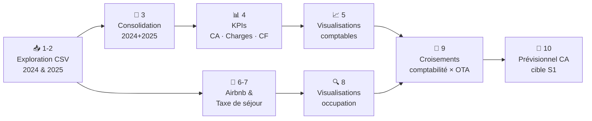

# Stage — Analyse de performance financière T&S Lodge

> Stage Data Analyst | Avril – Mai 2026  
> *Données et rapport partagés avec l'accord explicite des co-gérants (Sarah Blondel & Bernard Moizan)*

## Contexte

Mission de Data Analyst pour **T&S Lodge**, gîte de caractère situé en Indre (36), à ~15 km du Zoo de Beauval, exploité sous régime **LMNP (Location Meublée Non Professionnelle)** par ses co-gérants.

**Objectif : produire la matière première chiffrée pour la valorisation du bien en vue d'une mise en vente**, à destination des co-gérants et du cabinet comptable Axescibles. La valorisation elle-même reste du ressort du cabinet.

Période couverte : **juillet 2024 – décembre 2025** (18 mois d'exploitation effective).

## Stack technique

## Sources de données

| Source | Contenu | Période |
|--------|---------|---------|
| Journal comptable 2024 | PCG (latin-1, sep `;`, decimal `,`) | Mai–déc. 2024 |
| Journal comptable 2025 | PCG (cp850, sep `;`, decimal `,`) | Jan–déc. 2025 |
| Export Airbnb mensuel | Consultations, réservations, taux de conversion | Juil. 2024–fév. 2026 |
| Taxe de séjour 2024 | 41 séjours individuels — taux d'occupation, ADR, RevPAR | Juil–déc. 2024 |

## Pipeline d'analyse — 10 notebooks

## Résultats clés

### Chiffre d'affaires
| Exercice | CA net | Base corrigée |
|----------|--------|---------------|
| 2024 (6 mois) | 9 582 € | — |
| 2025 (12 mois) | 17 362 € | **18 626 €** (corrigé anomalie juil.) |

**+81% en valeur absolue** — à pondérer : 2024 ne couvre que 6 mois.

### Canaux de distribution
- **Airbnb : 80,7%** du CA total
- **Booking.com : 17,5%**
- **Direct : 1,7%** (bouche-à-oreille uniquement)

### Performance locative 2024
| Indicateur | Valeur |
|------------|--------|
| Taux d'occupation | 50,3% (août : 100%) |
| ADR (prix moyen/nuitée) | 98,28 € |
| RevPAR | 49,43 € |
| Durée moyenne de séjour | 2,07 nuits |

### Cash-flow
- **2024 : -14 808 €** — année de démarrage atypique (frais notaire 5 945€, équipement initial 7 515€, IK 3 464€)
- **2025 : +4 117 €** — premier exercice complet rentable

### Prévisionnel cible S1 (régime stabilisé LMNP maintenu)

`CA = Jours disponibles (340) × Taux d'occupation (55%) × ADR (105€)`

| Indicateur | 2024 réel | 2025 corrigé | Cible S1 |
|------------|-----------|--------------|----------|
| CA | 9 582 € | 18 626 € | **19 635 €** |
| RevPAR | 49,43 € | 54,78 € | 57,75 € |
| Taux d'occupation | 50,3% | N/A | 55% |
| ADR | 98,28 € | N/A | 105 € |

## Storytelling

> *"Le T&S Lodge a volontairement tourné en dessous de son potentiel : régime LMNP avec plafond CA délibéré à 23k€, aucune démarche d'optimisation commerciale, ménage/linge retirés en janvier 2026 sans ajustement tarifaire. Pourtant : 2025 est le premier exercice rentable (+4 117€ CF), et le taux d'occupation de 50% sur un gîte de 18 mois d'existence en zone rurale est solide. La cible prévisionnel à 19 635€ est conservatrice et atteignable — c'est précisément l'argument pour le repreneur."*

## Livrables

- `notebooks/` — 10 notebooks d'analyse (exploration, KPIs, visualisations, prévisionnel)
- `T_S_Lodge_rapport.docx` — Rapport d'analyse structuré (destinataires : co-gérants + Axescibles)
- `src/tools.py` — Fonctions utilitaires dont `sherlock()` (EDA custom)
